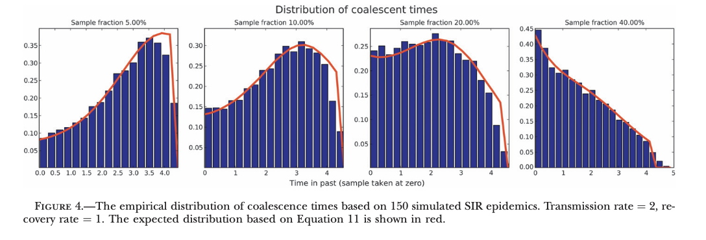
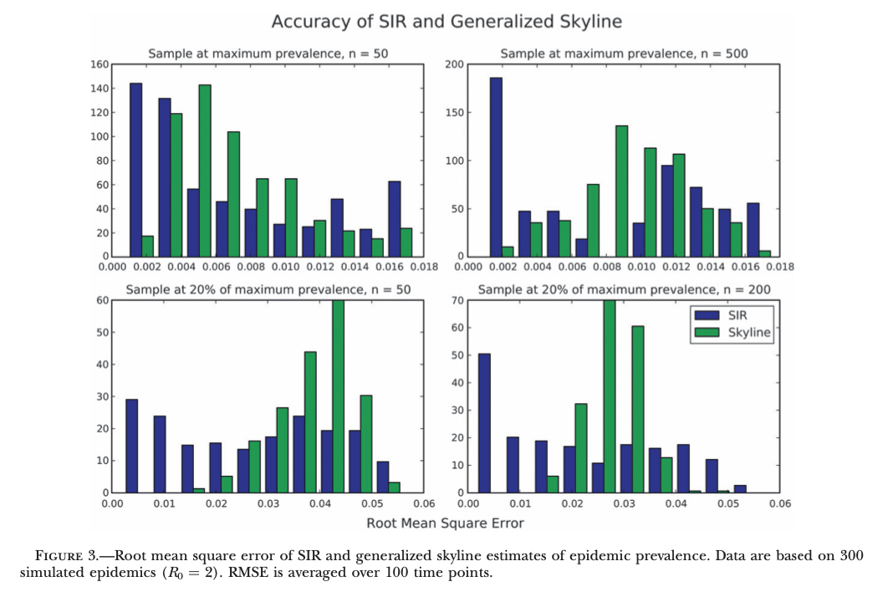
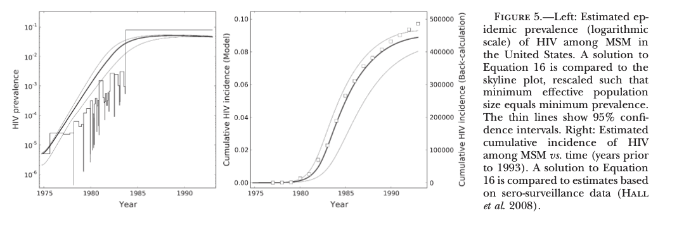

<!--Compile this presentation with pandoc using:
```
pandoc -f markdown -t beamer week3.md --slide-level 2  -o slides.pdf
``` -->

## Week 3 goals

We'll be doing a whirlwind tour of the following paper in order to paint a picture of the mathematics underlying phylodynamics methods.

- Phylodynamics of Infectious Disease Epidemics

In future weeks, we'll expand upon on the methods discussed here using the following two papers.

- Complex Population Dynamics and the Coalescent Under Neutrality
- Inferring the Source of Transmission with Phylogenetic Data

# Volz 2009: Phylodynamics of Infectious Disease Epidemics

## Takeaways

*"We present a formalism for unifying the inference of infected population sizes from genetic sequences and mathematical models of infectious disease in populations."*

In practice, we are able to fit epidemiological models to a phylogeny of viral sequences and make inferences regarding the disease dynamics.

## Methods

There are several practical questions that we seek to answer with these methods.

- If $n$ individuals from a total infected population of $\left| I\right|$ are sampled at time $T$, how many lineages existed at time $t<T$.
- How many of the lineages at time $t$ have surviving progeny at time $T$?

## Coalescent model for SIR

Suppose that we're given a human population of size $N$, the SIR dynamics of this population are described by the series of differential equations

\begin{align}
\frac{dS}{dt} &= -\beta S I\\
\frac{dI}{dt} &= \beta S I - \gamma I\\
\frac{dR}{dt} &= \gamma I,
\end{align}

where $S$, $I$, $R$ denote the fraction of the population which are susceptible, infected, and recovered respectively.

## Probability of observing coalescence

Given a population of size $N$ with $k$ lineages, the probability that these lineages merge is well approximated by ${k\choose 2} = \frac{k(k - 1)}{2}$ if $N$ is large relative to $k$. Therefore, given a coalescent event occurs between the infected individuals, the probability of observing this event in the $n$ sampled individuals is given by

$$
p_C =  {n\choose 2} / {{\left|I\right|}\choose 2}  = \frac{n(n-1)}{\left| I \right| (\left| I \right| - 1)}.
$$


## Probability of sampled ancestors

If we define a function $A(t, T)$ which describes the fraction of the individuals at time $t$ with sampled progeny at $T$. We'll use this definition alongside our early computation to find the probability of a transmission causing us to observe a coalescent event.

$$
p_c(t,T) = \left( \frac{A(t,T)}{I(t)} \right)^2,
$$

since the total number of lineages in a population with total size $N$ is given by $A(t,T)N$ and the number of infected individuals is $I(t)N$.
Therefore, we can compute the function $A(t,T)$ using the following ODE:

$$
-\frac{dA}{dt} = -\beta S I \cdot \left( \frac{A(t,T)}{I(t)} \right)^2.
$$


## Distribution of coalescent events

<!---Using this ancestor equations allows us to fit epidemic models to a fixed genealogy with no uncertainty. This can be extended to allow for uncertainty in branching times.--->

The ancestor function allows us to define the fraction of coalescent events which have occurred by time $\tau$ between times $t$ and $T$ as

$$
\mathbb{P}(t<\tau<T) = F(\tau)  = \frac{A(T,T) - A(\tau, T)}{A(T,T) - A(t,T)}.
$$

This forms a cumulative distribution function of coalescent times. Differentiating gives the corresponding probability density function

$$
f(\tau) = -\frac{dA}{dt} (\tau) \cdot \frac{1}{A(T,T) - A(t,T)}.
$$



## Fitting epidemic models to sequence data

Suppose we're given branching times $t_1, t_2, \ldots, t_{n-1}$ for a phylogeny of $n$ sequences. Then, we can write a log-likelihood for our branching times as

\begin{align}
\Lambda(t_1, \ldots, t_{n-1}\mid \theta) &= \sum_{i = 1}^{n-1} \log(f(\tau))\\
&= \sum_{i = 1}^{n-1} \log \left(-\frac{dA}{dt}(t_i) \right) -(n-1)\log(A(T,T) - A(t,T))
\end{align}

<!---Note: there appears to be an error in the original equation. $\frac{dA}{dt}$ takes only a single argument--->

## Fitting epidemic models to sequence data



## Application: Fitting to HIV-1 sequences

Using the likelihood function defined above, the authors fit an SIR to a phylogeny of 55 HIV-1 sequences sampled in 1993. This involved using modified infection dynamics:

\begin{align}
\frac{dS}{dt} = \mu - S^\alpha (\beta_1 I_1 + \beta_2 I_2) -\mu S\\
\frac{dI_1}{dt} = S^\alpha (\beta_1 I_1 + \beta_2 I_2) - \gamma_1 I_1 - \mu I_1\\
\frac{dI_2}{dt} = \gamma_1 I_1 - \gamma_2 I_2 - \mu I_2.
\end{align}

Here, $\beta_{\cdot}, \gamma_{\cdot}$ are transmission rates and recovery rates respectively. A subscript of $1$ refers to those individuals with an acute infection and subscript $2$ refers to chronic infection.

<!--- Note: there appears to be an error in the original equation.--->

## Application: Fitting to HIV-1 sequences.


